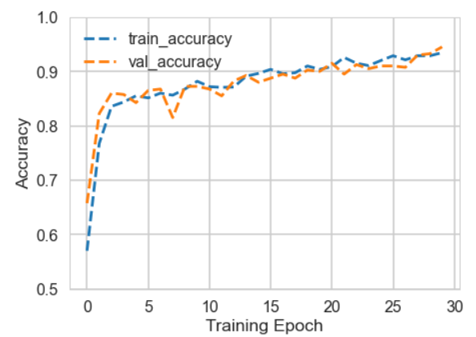
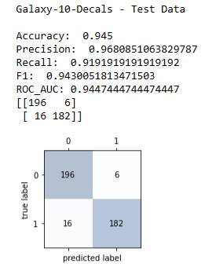
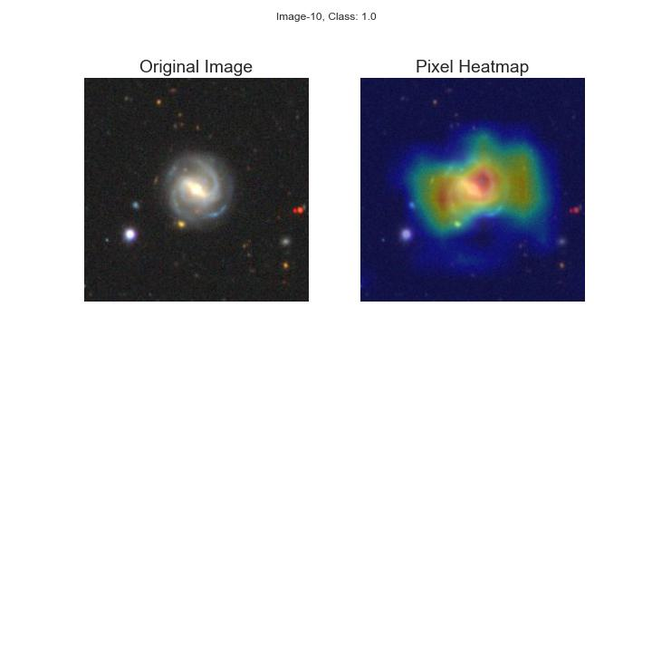
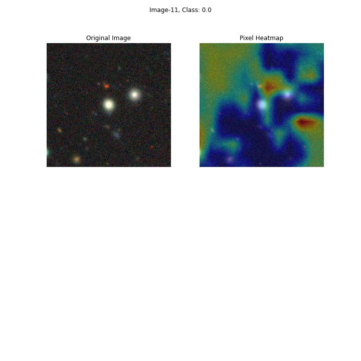
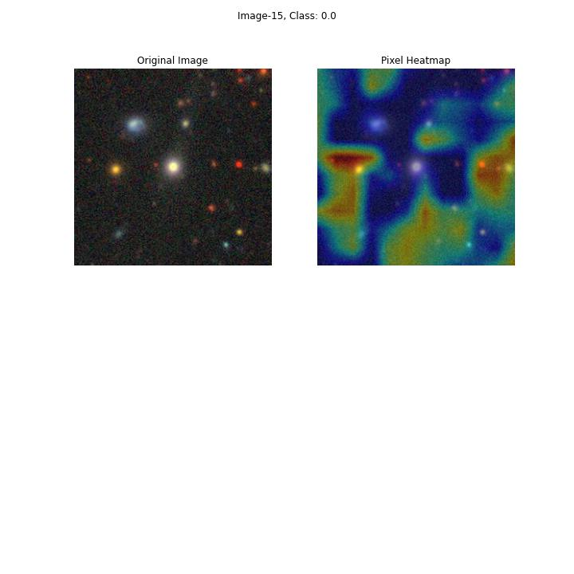
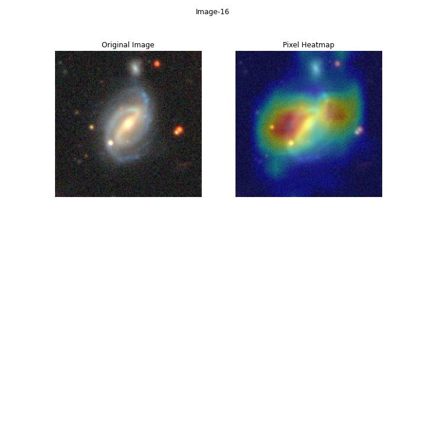

# Computer-Vision-for-Astronomy-Galaxy-Morphology
Data prep, CNN model training, performance evaluation, and pixel heatmap visualization for galaxy morphology classification

## Data Overview

The Galaxy10 DECals dataset represents a significant enhancement over the original Galaxy10 dataset. While Galaxy10 utilized ~270,000 galaxy images from Galaxy Zoo Data Release 2, Galaxy10 DECals leverages ~441,000 high-resolution galaxy images from the DESI Legacy Imaging Surveys. These images come from the DECals survey campaigns 'ab' and 'c' and provide markedly improved quality compared to the SDSS images used in Galaxy10. The new dataset also implements more rigorous filtering in its curation, selecting ~18,000 images across 10 distinct morphological classes using crowdsourced classifications from Galaxy Zoo volunteers. Furthermore, the morphological classes have been refined to maximize distinction between categories. For example, the 'Edge-on Disk with Boxy Bulge' class from the original Galaxy10 contained only 17 images and was dropped.

In this repo will work with a prepared version of the Galaxy10-DECals Dataset, made available by the astroNN python library,

    https://astronn.readthedocs.io/en/latest/galaxy10.html
    
Galaxy10-DECals contains 10 broad classes of galaxy images, the details of how these were determined are available here,

    https://github.com/henrysky/Galaxy10
    
For our purposes, this is what we need to know: 

    Galaxy10 dataset (17736 images)   
    ├── Class 0 (1081 images): Disturbed Galaxies   
    ├── Class 1 (1853 images): Merging Galaxies   
    ├── Class 2 (2645 images): Round Smooth Galaxies   
    ├── Class 3 (2027 images): In-between Round Smooth Galaxies   
    ├── Class 4 ( 334 images): Cigar Shaped Smooth Galaxies   
    ├── Class 5 (2043 images): Barred Spiral Galaxies   
    ├── Class 6 (1829 images): Unbarred Tight Spiral Galaxies   
    ├── Class 7 (2628 images): Unbarred Loose Spiral Galaxies   
    ├── Class 8 (1423 images): Edge-on Galaxies without Bulge   
    └── Class 9 (1873 images): Edge-on Galaxies with Bulge   

----

There are several key factors that drive the different morphologies and shapes we observe in galaxies:

* Spin/Angular Momentum: The angular momentum of the primordial gas clouds from which galaxies formed determines if they flatten into spinning disks or remain more spherical. Higher spin produces spiral and disk shaped galaxies.

* Stellar Mass: More massive galaxies tend to become ellipticals, while less massive galaxies tend to be spirals. Massive galaxies fuse together their gas early and fast, favoring an elliptical shape.

* Gas Availability: Spiral galaxies retain significant gas reservoirs to sustain ongoing star formation. Elliptical galaxies use up their gas rapidly, leaving little left to form new stars or spiral arms.

* Mergers: Galaxy collisions can transform spiral galaxies into ellipticals by disrupting structures and redistributing stars and gas.

* Dark Matter Halos: The shape and concentration of dark matter halos surrounding galaxies impacts the distribution of ordinary matter.

* Supermassive Black Holes: Active galactic nuclei and black hole feedback can heat and eject cold gas needed for star formation in spirals.

* Environment: Galaxies in crowded clusters tend to become ellipticals, while isolated field galaxies retain their gas and spiral shapes.

* Time: Younger galaxies tend to be more gaseous and disk-like. Older galaxies use up their gas and transform into spheroids.

To summarize, the interplay between mass, angular momentum, gas contents, mergers, environment, and time drive the different galaxy morphologies we see in the magnificent galaxy population we observe from our tiny perch on the third rock from the Sun.

In this study, we select 2 distinct classes of galaxy morphologies and train a neural network to distinguish the galaxy types, and then implement GradCAM to understand what the neural network has learned in pixel space.

We work with Class 2: Round Smooth Galaxies, and Class 5: Barred Spiral Galaxies.

## Convolutional Neural Network (CNN) Model Description

We construct a convolutional neural network (CNN) for image classification, implemented in Keras and Tensorflow. It takes 256x256 RGB images as input (shape=(256, 256, 3)). The model applies several convolutional and max pooling layers to extract features from the images:

* Convolutional layer with 32 3x3 filters and ReLU activation
* Max pooling layer to downsample
* Convolutional layer with 64 3x3 filters and ReLU activation
* Max pooling
* Convolutional layer with 128 3x3 filters and ReLU activation
* Max pooling
* Convolutional layer with 256 3x3 filters and ReLU activation
* Max pooling
* Convolutional layer with 256 3x3 filters and ReLU activation

This extracts increasingly abstract features from the input images.

The features are then flattened and passed through a dropout layer for regularization.

Finally, a dense layer with sigmoid activation is used for binary classification, outputting a probability between 0-1.

The layers are compiled into a Keras Tensorflow model that is trained on galaxy morphology image data for morphology classification. The convolutional and pooling layers allow the model learn spatial hierarchy of features from the supplied images.

## Classification Results

The model performance on the test dataset can be summarized:

Accuracy: 0.945. Accuracy measures how often the model correctly predicted the actual label. An accuracy of 0.945 means the model predicted the correct label 94.5% of the time.

Precision: 0.968. Precision looks at how many selected items are relevant. A precision of 0.968 means 96.8% of images the model predicted as positive were actually positive.

Recall: 0.919. Recall measures how many relevant items are selected. A recall of 0.919 means the model correctly identified 91.9% of all positive examples.

F1: 0.943. F1 score balances precision and recall. An F1 of 0.943 is the harmonic mean of precision and recall.

ROC_AUC: 0.944. ROC AUC evaluates the model's ability to distinguish classes. An AUC of 0.944 means the model is highly capable of distinguishing positives from negatives.

Confusion Matrix: [[196 6] [ 16 182]] he confusion matrix shows the model predicted 196 examples correctly as positive and 182 correctly as negative. It misclassified 6 positives as negative, and 16 negatives as positive.

Overall, these metrics indicate a strongly performing model, achieving high accuracy, precision, recall and AUC.

## GradCam Pixel Heatmap

The GradCam algorithm generates pixel heatmaps from image classification models. GradCam uses the gradient information flowing into the final convolutional layer of a CNN to understand which regions in the image are contributing most towards the predicted class score.

A summary of the GradCam algorithm:

* Pass an image through the CNN and get the output class score.

* Calculate the gradient of the score with respect to the final convolutional layer feature maps.

* Global average pool the gradients over the width and height dimensions to get the importance weights of each feature map channel.

* Weight the feature maps from the last convolution layer by their importance weights.

* Sum the weighted feature maps channel-wise to get the final GradCam heatmap.

The resulting heatmap highlights the pixels in the image that strongly influenced the predicted class score. Red regions correspond to high importance, blue regions are low importance.

GradCam does not require changes to the original model, and uses gradient information to provide "fine-grained" visual explanations for predictions. It is highly useful, though not perfect, for understanding and interpreting model behavior on image data.

